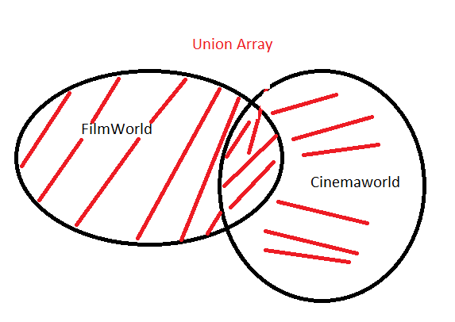
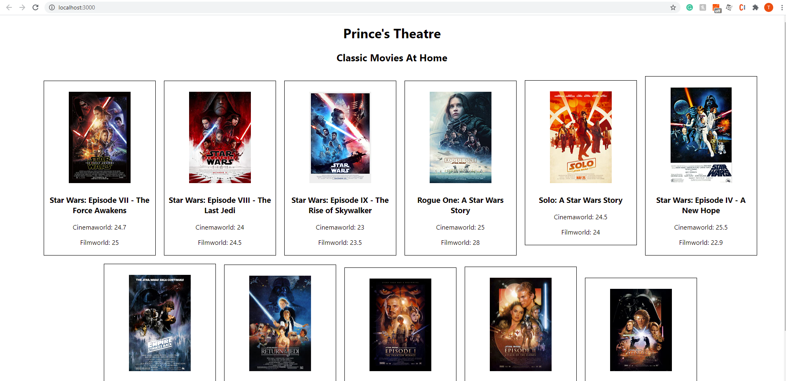

# Movie Price Aggregator 

## Assumption & Limitation
I assumed unique id for each provide can not use to match mutual property, for example, movie title is used to match between 2 provider. However, there may be missed matching if the title has any typo or additional / lack of characters.
Ideally, a universal Id such as EIDR should be returned by the API for matching movies across providers 

## Usage Guideline
- Install package: `npm install`
- Start the app `npm start`
- Run the test `npm run test`

## Explanation
- I fetched 2 api into 2 different arrays name itemsFilmWorld and itemCinemaWorld
- I used the fetchRetry (3 times with increasing interval) function to manage the instability of the API server
- I used constants in filmState file to improve the code reusability and reduce the human errors, maintenance overhead.
- I used the auto handling function to reload the app if it does not work after retrying several times.
- I created 2 custom representative arrays including the Title property to compare the elements inside those two arrays based on the index value
- I created and get the value of the Union object of two representative arrays by using 2 loops separately and push() function.
- If the films title of FilmWorld are matched with the ones of Cinemaworld, the price and title of those two providers will be added into the union object respectively
- On the other hand, if the pairs are not matched to each other, the price will be added to 1 provider and other can be considered as NOT AVAILABLE.

    
    

